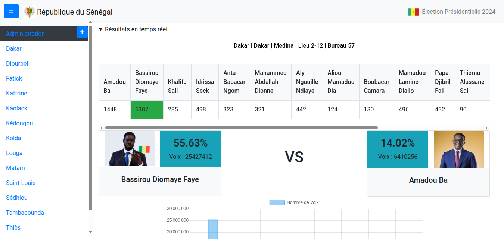

# Projet Élection Présidentielle (Realtime)

## Description
Application web PHP/MySQL/Bootstrap pour la **visualisation des résultats des élections présidentielles en temps réel**.  
Permet de suivre les résultats globaux et par entités administratives avec des graphiques, tableaux et détails par bureaux de vote.

### Fonctionnalités principales

- **Classement des 2 meilleurs candidats** affiché en haut
- **Statistiques et graphiques** (courbes, barres, pourcentage, nombre de voix)
- **Navigation par région → département → commune** via le menu gauche
- **Affichage détaillé des résultats par bureau de vote** (modal)
- **Interface sécurisée avec rôles** :
  - Admin  
  - CENA (Commission Électorale Nationale Autonome)  
  - CER (Commission Électorale Régionale)  
  - CED (Commission Électorale Départementale)  
  - Bureau (saisie des résultats une seule fois)
- **Temps réel** : les résultats sont mis à jour et recalculés automatiquement

---

## Vidéo de démonstration
Visualisation de l’application en action :  

[](https://youtu.be/ku0ozZZu2MA)

---

## Capture d'écran


---

## Structure du projet
assets/ # CSS, JS, images
assets/screenshots/ # Screenshots pour README
database/ # Scripts SQL et connexion MySQL
videos/ # Vidéo de démonstration
public/ # Fichiers accessibles via navigateur
index.php # Page principale
login.php # Page de connexion sécurisée
dashboard/ # Interfaces selon rôle et entité
includes/ # Fonctions utilitaires et templates

## Installation

1. Cloner le projet :  
```bash
git clone git@github.com:aliou90/election_presidentielle_realtime.git
```

2. S'assurer que votre base de données est démarrée

3. Placer le projet dans un serveur local (XAMPP, WAMP, ou PHP Built-in Server).

4. Configurer la base MySQL presidentielles et importer les tables.
```bash
# Aller dans le dossier du projet
cd CHEMIN_VERS_LE_SITE/

# Créer une base de données `presidentielles` avec ses tables
php config/build-database.php

# Alimenter la BD avec l'insertion des votes et calcules de résultats 
php config/build-realtime-results.php

# Insérer les données du système élctoral (régions, départements etc...)
php config/build-datasystem.php
```


5. Accéder via navigateur :
http://localhost/election_presidentielle

** Auteur
Aliou Mbengue – alioumbengue2828@gmail.com
